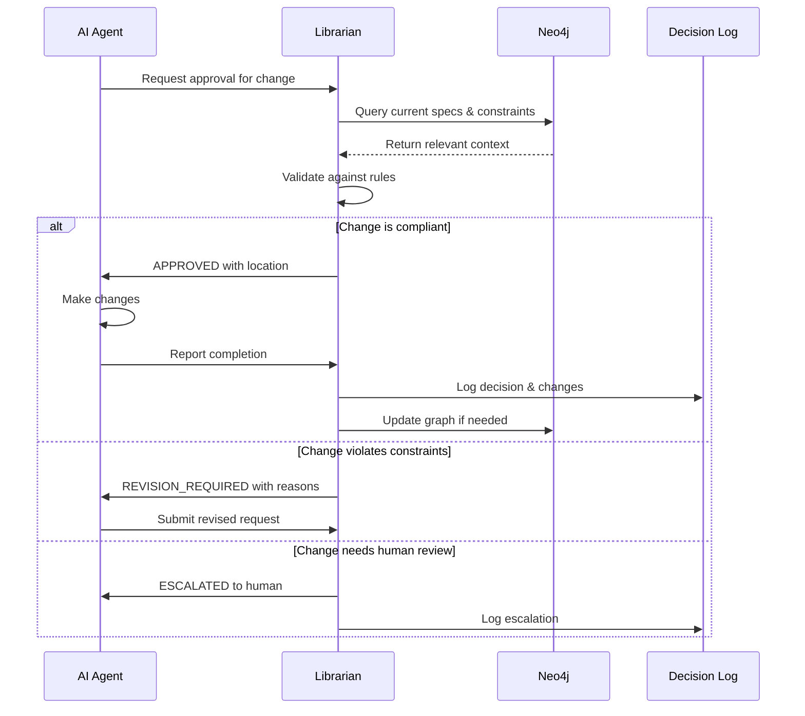

# Librarian Agent System Architecture v2.0

## Executive Summary

The Librarian Pattern is a **meta-agent governance system** that acts as the sole authority for all AI agent interactions with a codebase. It prevents chaotic, uncoordinated modifications by enforcing documentation standards, maintaining immutable records, and ensuring all changes align with specifications.

This document represents the unified, conflict-resolved architecture based on analysis of all project specifications and research.

## Problem Statement

### Current State: Agent Chaos
Without governance, AI agents (Claude, Copilot, Gemini, etc.) working on a codebase:
- Write documentation in arbitrary locations
- Make uncontrolled changes to code
- Lack consistent project context
- Create organizational chaos through uncoordinated modifications
- Violate architectural constraints without detection

### Solution: Centralized Governance
The Librarian Agent provides:
- **Single point of control** for all agent interactions
- **Enforced standards** for documentation and code changes
- **Immutable audit trail** of all modifications
- **Authoritative context** provided to all agents
- **Real-time drift detection** between code and specifications

## Core Architecture Principles

### The 8 Pillars of Governance

1. **Centralized Authority**: All AI agents must route documentation and code changes through the Librarian
2. **Immutable Records**: Every change is permanently logged with full audit trail
3. **Standardized Documentation**: All documents follow enforced templates and locations
4. **Contextual Intelligence**: Agents receive authoritative project context for decisions
5. **Behavioral Control**: Unauthorized changes are detected and prevented automatically
6. **Documentation Authority**: Official documentation is the single source of truth
7. **Drift Detection**: Mismatches between code and documentation are identified
8. **Compliance Verification**: Requirements can be traced and verified against implementation

## System Architecture

### High-Level Component Model

```
┌───────────────────────────────────────────────────────┐
│              SPECIFICATION LAYER                      │
│  ┌────────────────────────────────────────────────┐   │
│  │  • Architecture Docs    • Design Specs         │   │
│  │  • API Contracts        • Constitution Rules   │   │
│  │  • Decision Log         • Task Backlogs        │   │
│  └────────────────────────────────────────────────┘   │
└──────────────────────┬────────────────────────────────┘
                       │
                 ┌─────▼──────┐
                 │  LIBRARIAN  │
                 │    AGENT    │
                 │             │
                 │ ┌─────────┐ │
                 │ │ Neo4j   │ │
                 │ │ Graph + │ │
                 │ │ Vectors │ │
                 │ └─────────┘ │
                 └─────┬──────┘
                       │
     ┌─────────────────┼─────────────────┐
     │                 │                 │
┌────▼────┐      ┌────▼────┐      ┌────▼────┐
│ AGENT 1 │      │ AGENT 2 │      │ AGENT 3 │
│ Claude  │      │ Copilot │      │ Gemini  │
└────┬────┘      └────┬────┘      └────┬────┘
     └─────────────────┼─────────────────┘
                       │
                 ┌─────▼──────┐
                 │  CODEBASE   │
                 └─────────────┘
```

### Technology Stack (Final Decision)

```yaml
Core Stack:
  Database: Neo4j Community Edition 5.x+
  Language: Python 3.11+
  API Framework: FastAPI
  Deployment: Docker Compose

Graph & Search:
  Graph Driver: neo4j-driver (official)
  Vector Operations: Neo4j native vector index
  RAG Framework: LangChain (Neo4jVector, Neo4jGraph)
  Embedding Dimension: 768

Embeddings & LLM:
  Embedding Model: nomic-embed-text (via Ollama)
  Embedding Dimension: 768
  LLM Provider: Ollama (local) with OpenRouter fallback
  Local Models: Llama3, Mistral, or Gemma

Development Tools:
  Testing: pytest
  Environment: venv + requirements.txt
  Monitoring: watchdog (Phase 2)
  Documentation: OpenAPI (auto-generated by FastAPI)
```

### Deployment Architecture

**Phase 0-2 (Development)**: Native Windows Installation
```yaml
development:
  type: native-windows
  components:
    neo4j:
      tool: Neo4j Desktop
      ports: [7474, 7687]
      location: local-application

    ollama:
      tool: Ollama for Windows
      port: 11434
      location: C:\Users\{user}\.ollama

    librarian-api:
      runtime: python 3.11+
      port: 8000
      command: uvicorn src.main:app --reload
      environment:
        - NEO4J_URI=bolt://localhost:7687
        - OLLAMA_HOST=http://localhost:11434
```

**Phase 3 (Production Deployment)**: Docker Compose
```yaml
deployment:
  type: single-machine-containerized
  containers:
    neo4j:
      image: neo4j:5-community
      ports: [7474, 7687]
      volumes:
        - ./neo4j/data:/data
      environment:
        - NEO4J_AUTH=neo4j/librarian-pass

    librarian-api:
      build: ./
      ports: [8000]
      depends_on: [neo4j]
      environment:
        - NEO4J_URI=bolt://neo4j:7687
        - OLLAMA_HOST=http://host.docker.internal:11434

    ollama:
      image: ollama/ollama
      ports: [11434]
      volumes:
        - ./ollama:/root/.ollama
```

**Rationale**: Native development provides faster iteration and easier debugging. Docker containerization happens in Phase 3 for production deployment and portability.

## Data Model

### Graph Schema

#### Core Node Types
```cypher
// Documentation Nodes
(:Architecture {
  id: String,           // Unique identifier
  version: String,      // Semantic version
  subsystem: String,    // Area of responsibility
  status: String,       // draft|review|approved|deprecated
  owners: [String],     // Owner handles
  last_reviewed: Date,
  content: String,      // Document content
  embedding: [Float]    // 768-dim vector
})

(:Design {
  id: String,
  version: String,
  component: String,
  status: String,
  owners: [String],
  last_reviewed: Date,
  content: String,
  embedding: [Float]
})

(:Requirement {
  rid: String,          // Requirement ID
  text: String,         // Requirement description
  priority: String,     // high|medium|low
  source: String,       // Source document ID
  status: String        // active|deferred|deprecated
})

(:CodeArtifact {
  path: String,         // File path
  lang: String,         // Programming language
  last_modified: Date,
  hash: String          // Content hash
})

(:Decision {
  id: String,
  date: DateTime,
  rationale: String,
  author: String,
  kind: String,         // approve|reject|defer
  impact: String        // Description of impact
})

(:AgentRequest {
  id: String,
  agent_id: String,     // Which AI agent
  timestamp: DateTime,
  request_type: String, // create|modify|delete
  target: String,       // What they want to change
  rationale: String,    // Why they want to change it
  status: String,       // pending|approved|rejected|escalated
  response: String      // Librarian's response
})
```

#### Core Relationships
```cypher
// Document Hierarchy
(:Architecture)-[:DEFINES]->(:Requirement)
(:Design)-[:IMPLEMENTS]->(:Architecture)
(:Design)-[:SATISFIES]->(:Requirement)
(:CodeArtifact)-[:IMPLEMENTS]->(:Design)
(:CodeArtifact)-[:IMPLEMENTS]->(:Requirement)

// Decision Flow
(:Decision)-[:SUPERSEDES]->(:Architecture|:Design|:Requirement)
(:Decision)-[:APPROVES|:REJECTS]->(:AgentRequest)
(:Decision)-[:CREATED_FROM]->(:AgentRequest)

// Agent Interactions
(:AgentRequest)-[:TARGETS]->(:Architecture|:Design|:CodeArtifact)
(:AgentRequest)-[:REFERENCES]->(:Architecture|:Design)
(:AgentRequest)-[:RESULTED_IN]->(:Decision)
```

### Vector Index Configuration
```cypher
-- Create unique constraints
CREATE CONSTRAINT doc_id IF NOT EXISTS
  FOR (d:Architecture) REQUIRE d.id IS UNIQUE;
CREATE CONSTRAINT design_id IF NOT EXISTS
  FOR (d:Design) REQUIRE d.id IS UNIQUE;
CREATE CONSTRAINT request_id IF NOT EXISTS
  FOR (r:AgentRequest) REQUIRE r.id IS UNIQUE;

-- Create vector indexes for semantic search
CREATE VECTOR INDEX architecture_embedding IF NOT EXISTS
  FOR (a:Architecture) ON (a.embedding)
  OPTIONS {
    indexConfig: {
      'vector.dimensions': 768,
      'vector.similarity_function': 'cosine'
    }
  };

CREATE VECTOR INDEX design_embedding IF NOT EXISTS
  FOR (d:Design) ON (d.embedding)
  OPTIONS {
    indexConfig: {
      'vector.dimensions': 768,
      'vector.similarity_function': 'cosine'
    }
  };
```

## API Design

### Core Endpoints

```python
# Agent Interaction Endpoints
POST /agent/request-approval
  Request: {
    agent_id: str,
    action: "create" | "modify" | "delete",
    target_type: "architecture" | "design" | "code",
    target_id: str | None,
    content: str,
    rationale: str,
    references: [str]  # IDs of specs consulted
  }
  Response: {
    request_id: str,
    status: "approved" | "revision_required" | "escalated",
    feedback: str,
    approved_location: str | None,
    required_changes: [str]
  }

POST /agent/report-completion
  Request: {
    request_id: str,
    completed: bool,
    changes_made: [str],
    deviations: [{
      description: str,
      justification: str
    }],
    test_results: dict
  }
  Response: {
    acknowledged: bool,
    decision_id: str,
    next_steps: [str]
  }

# Query Endpoints
POST /query/semantic
  Request: {
    query: str,
    context_type: "architecture" | "design" | "all",
    limit: int = 10
  }
  Response: {
    results: [{
      id: str,
      type: str,
      content: str,
      relevance_score: float,
      metadata: dict
    }]
  }

GET /query/cypher
  Query Parameters:
    q: str  # Cypher query
  Response: {
    results: [dict]
  }

# Validation Endpoints
GET /validation/drift-check
  Response: {
    drift_detected: bool,
    mismatches: [{
      type: "design_ahead_of_architecture" | "undocumented_code" | "uncovered_requirement",
      details: dict
    }]
  }

GET /validation/compliance/{subsystem}
  Response: {
    compliance_rate: float,
    violations: [dict],
    uncovered_requirements: [dict]
  }

# Administrative Endpoints
POST /admin/ingest
  Request: {
    document_path: str,
    document_type: str,
    metadata: dict
  }
  Response: {
    success: bool,
    node_id: str,
    relationships_created: int
  }

GET /health
  Response: {
    status: "healthy" | "degraded",
    neo4j: bool,
    ollama: bool,
    version: str
  }
```

## Agent Interaction Protocol

### Request Flow



### Validation Rules

```python
class ValidationRules:
    """Core rules enforced by the Librarian"""

    def validate_request(self, request: AgentRequest) -> ValidationResult:
        checks = [
            self.check_documentation_standards(),
            self.check_version_compatibility(),
            self.check_architecture_alignment(),
            self.check_requirement_coverage(),
            self.check_constitution_compliance()
        ]

        # All checks must pass for approval
        if all(check.passed for check in checks):
            return ValidationResult(status="approved")

        # Critical violations require escalation
        critical_violations = [c for c in checks if c.severity == "critical"]
        if critical_violations:
            return ValidationResult(status="escalated", reasons=critical_violations)

        # Otherwise revision required
        return ValidationResult(status="revision_required", reasons=checks)
```

## Implementation Phases

### Phase 0: Development Setup (1-2 days)
**Goal**: Local development environment ready

**Development Approach**: Native Windows installation (no Docker initially)

- [ ] Install Neo4j Desktop (GUI for Windows)
- [ ] Install Ollama for Windows
- [ ] Create Python project structure (src/, tests/, config/)
- [ ] Write requirements.txt with dependencies
- [ ] Setup virtual environment
- [ ] Create .env.template for configuration
- [ ] Initialize Neo4j database with schema
- [ ] Verify Ollama embedding model works
- [ ] Document native setup in README.md

**Success Criteria**: Can run `python -m pytest` and connect to local Neo4j

**Why Native First?**
- Easier debugging (no container layers)
- Neo4j Desktop provides visual graph explorer
- Faster iteration cycle
- No Docker learning curve
- Direct access to logs and processes

### Phase 1: Foundation (Week 1-2)
**Goal**: Basic agent control system operational

- [ ] Implement graph operations module (Neo4j driver wrapper)
- [ ] Create vector index and embedding integration
- [ ] Build document ingestion pipeline
- [ ] Implement FastAPI service structure
- [ ] Create agent request/approval endpoints
- [ ] Add immutable logging to graph
- [ ] Implement semantic search capability
- [ ] Write unit and integration tests

**Success Criteria**: Can ingest documents, query semantically, and reject non-compliant agent requests

### Phase 2: Agent Governance (Week 3-4)
**Goal**: Full agent coordination working

- [ ] Implement all validation rules
- [ ] Add drift detection queries
- [ ] Create compliance verification endpoints
- [ ] Build agent context assembly
- [ ] Add decision tracking
- [ ] Implement escalation workflows
- [ ] Create end-to-end agent workflow tests
- [ ] Add comprehensive error handling

**Success Criteria**: Agents can request approval, get context, and report completion with full audit trail

### Phase 3: Production Ready (Week 5+)
**Goal**: Deployable system with operational features

**Deployment Containerization**:
- [ ] Create Dockerfile for FastAPI application
- [ ] Write docker-compose.yml for all services
- [ ] Create deployment scripts (deploy.sh, update.sh)
- [ ] Implement backup/recovery procedures
- [ ] Add health checks and monitoring endpoints
- [ ] Create operational runbooks
- [ ] Test deployment on clean machine

**Enhanced Features**:
- [ ] Add file monitoring with watchdog (optional)
- [ ] Implement caching layer for frequently accessed documents
- [ ] Add batch document processing
- [ ] Create performance monitoring dashboard (optional)
- [ ] Implement scheduled maintenance tasks

**Success Criteria**: Can deploy with `docker-compose up` on any machine and system runs reliably under continuous use

## Validation Queries

### Critical Queries for Governance

```cypher
-- Find uncovered requirements
MATCH (a:Architecture)-[:DEFINES]->(req:Requirement)
WHERE NOT exists((req)<-[:SATISFIES]-(:Design))
  AND req.status = 'active'
RETURN req.rid, req.text, req.priority, a.id as source
ORDER BY req.priority DESC;

-- Detect design drift
MATCH (d:Design)-[:IMPLEMENTS]->(a:Architecture)
WHERE d.version > a.version
  AND NOT exists((:Decision)-[:SUPERSEDES]->(d))
RETURN d.id, d.version, a.id, a.version,
       d.last_reviewed as last_design_update;

-- Find undocumented code
MATCH (c:CodeArtifact)
WHERE NOT exists((c)-[:IMPLEMENTS]->(:Design|:Requirement))
  AND c.last_modified > datetime() - duration('P7D')
RETURN c.path, c.lang, c.last_modified
ORDER BY c.last_modified DESC;

-- Check agent compliance rate
MATCH (r:AgentRequest)
WHERE r.timestamp > datetime() - duration('P30D')
WITH r.agent_id as agent,
     count(CASE WHEN r.status = 'approved' THEN 1 END) as approved,
     count(*) as total
RETURN agent,
       toFloat(approved) / total * 100 as compliance_rate
ORDER BY compliance_rate DESC;
```

## Success Metrics

| Metric | Target | Measurement Method |
|--------|--------|-------------------|
| **Spec Compliance Rate** | >95% | Approved requests / Total requests |
| **Drift Detection Time** | <5 min | Time from code commit to detection |
| **False Positive Rate** | <10% | Invalid rejections / Total rejections |
| **Agent Response Time** | <2 sec | API response time P95 |
| **System Uptime** | >99% | Health check monitoring |

## Risk Mitigation

| Risk | Mitigation |
|------|------------|
| **Neo4j performance degradation** | Index optimization, query tuning, caching |
| **Agent circumvention** | File system permissions, git hooks |
| **Embedding model quality** | A/B test models, maintain fallback options |
| **Human review bottleneck** | Clear escalation criteria, batch reviews |
| **Data loss** | Regular Neo4j backups, immutable audit log |

## Configuration Management

### Environment Variables
```bash
# Neo4j Configuration
NEO4J_URI=bolt://localhost:7687
NEO4J_USER=neo4j
NEO4J_PASSWORD=librarian-pass

# Ollama Configuration
OLLAMA_HOST=http://localhost:11434
OLLAMA_EMBEDDING_MODEL=nomic-embed-text
OLLAMA_LLM_MODEL=llama3

# OpenRouter Fallback (Optional)
OPENROUTER_API_KEY=your-key-here
OPENROUTER_BASE_URL=https://openrouter.ai/api/v1

# Librarian Configuration
LIBRARIAN_PORT=8000
LIBRARIAN_LOG_LEVEL=INFO
LIBRARIAN_ESCALATION_WEBHOOK=  # Optional Slack/Discord webhook
```

### Document Standards
All governed documents must include:
```yaml
---
doc: architecture | design | tasks | research
subsystem: component-area
id: unique-identifier
version: semver
status: draft | review | approved | deprecated
owners: ["@handle"]
requires: ["dependency@version"]
compliance_level: strict | flexible | advisory
drift_tolerance: none | minor | moderate
---
```

## Extended Capabilities

### Repository Portfolio Management
The Librarian's graph database can be extended to support **portfolio-wide repository tracking and analysis**. In this model:

**The Librarian Provides**:
- Graph schema for `Repository`, `AnalysisRun`, `AnalysisResult`, `ProjectHealth`, and `Sprint` nodes
- API endpoints for storing and querying repository metadata
- Historical tracking of repository health scores over time
- Query capabilities for portfolio intelligence

**External Agent Systems (Colossus, Watchmen) Provide**:
- Repository discovery and analysis orchestration
- Invocation of analysis tools (Perplexity via web automation, static analyzers, etc.)
- Sprint planning and coordination workflows
- Submission of analysis results to the Librarian's API

This separation of concerns allows the Librarian to remain focused on its core strength: **data storage, relationship management, and query capabilities**, while external systems handle orchestration and analysis.

See [`docs/subdomains/repository-portfolio-management.md`](./subdomains/repository-portfolio-management.md) for detailed specifications.

## Future Considerations

### Potential Enhancements (Not Phase 1)
- **Temporal Knowledge Graphs**: Track when information becomes valid/invalid
- **Multi-hop Reasoning**: Allow agents to chain complex queries
- **Graph Algorithms**: Use PageRank for importance scoring
- **CDC Integration**: Neo4j change data capture for event streaming
- **MCP Protocol**: Standardized context protocol when mature

### Scaling Considerations
Current design supports:
- ~1000 documents
- ~10 agents
- ~100 requests/day
- Single machine deployment

For larger scale, consider:
- Neo4j clustering
- Redis caching layer
- Message queue for agent requests
- Dedicated vector database (Qdrant/Weaviate)

## Conclusion

This architecture provides a practical, implementable solution for AI agent governance. By using proven technologies (Python, Neo4j, FastAPI, LangChain) and focusing on the core problem (agent chaos), we can deliver a working system in 2 weeks that prevents uncoordinated AI modifications to codebases.

The phased approach ensures early value delivery while maintaining flexibility for future enhancements. The system's strength lies not in complex technology but in its simple premise: one central authority that ensures all agents "ask permission" before making changes and "report back" afterward.

## References

- Neo4j Python Driver: https://neo4j.com/docs/python-manual/current/
- LangChain Neo4j Integration: https://python.langchain.com/docs/integrations/vectorstores/neo4jvector/
- FastAPI Documentation: https://fastapi.tiangolo.com/
- Ollama API: https://github.com/ollama/ollama/blob/main/docs/api.md

## Document History

- v2.0.0 (2024-11-10): Unified architecture resolving all specification conflicts
- v1.0.0 (Previous): Initial scattered specifications across multiple documents