**Implementation Plan:** [[🚀 Project - Library Agent]]

# The Librarian Pattern: Implementation Blueprint

## Executive Summary

The Librarian Pattern introduces a **meta-agent governance system** that ensures code implementation stays aligned with specifications and design documents through conversational validation rather than rigid tooling. Unlike traditional MCP (Model Context Protocol) approaches that rely on explicit schemas and UI-driven workflows, the Librarian acts as a living reviewer that maintains project coherence across multiple AI agents and human developers.

---

## Key Strategic Decisions

Before implementing the Librarian Pattern, teams must make several foundational decisions that will shape the entire governance system. These choices affect tooling, workflow, and the balance between automation and human oversight.

### 1. Governance Philosophy

**Decision Required:** How strict should spec adherence be?

| Option | When to Choose | Implications |
|--------|---------------|--------------|
| **Strict Compliance** | Safety-critical systems, regulated industries, large teams | • Every deviation requires approval<br>• Slower iteration speed<br>• Higher consistency<br>• Constitution violations block merges |
| **Guided Flexibility** | Startup environments, prototyping, small teams | • Deviations logged but not blocking<br>• Librarian suggests rather than enforces<br>• Faster iteration<br>• Risk of spec drift |
| **Hybrid by Component** | Mixed criticality systems | • Core components strict, periphery flexible<br>• Requires subsystem classification<br>• More complex configuration |

### 2. Document Storage Strategy

**Decision Required:** Where will specifications live?

| Option | Pros | Cons | Best For |
|--------|------|------|----------|
| **In-Repository** | • Version controlled with code<br>• Single source of truth<br>• Works offline | • Requires dev access for updates<br>• Limited formatting | Small to medium teams with technical stakeholders |
| **External (Notion/Confluence)** | • Rich editing UI<br>• Non-dev accessibility<br>• Better visuals | • Sync complexity<br>• Potential version skew<br>• External dependency | Organizations with mixed technical/business stakeholders |
| **Hybrid** | • Specs in repo, supplementary in external<br>• Best of both worlds | • Multiple sources to maintain<br>• Sync overhead | Large organizations with diverse needs |

### 3. Communication Architecture

**Decision Required:** How do agents communicate with the Librarian?

| Option | Complexity | Scalability | Latency | Best For |
|--------|------------|-------------|---------|----------|
| **PR Comments** | Low | Limited | High | Small teams, GitHub-centric workflows |
| **Message Queue** | Medium | High | Low | Distributed teams, multiple parallel agents |
| **Direct API** | Low | Medium | Lowest | Real-time validation needs |
| **Event Bus** | High | Highest | Medium | Enterprise environments with existing event infrastructure |

### 4. Librarian Deployment Model

**Decision Required:** How should the Librarian agent be hosted?

| Option | Cost | Maintenance | Availability | Best For |
|--------|------|-------------|--------------|----------|
| **GitHub Actions** | Free-Low | Minimal | Per-run | Open source, small projects |
| **Serverless (Lambda/Cloud Functions)** | Pay-per-use | Low | Always-on | Variable workloads, cost optimization |
| **Container Service (ECS/K8s)** | Medium-High | Medium | Always-on | High-volume, predictable load |
| **Dedicated VM** | Fixed | High | Always-on | On-premise requirements, full control |

### 5. Decision Authority Matrix

**Decision Required:** Who can override the Librarian?

```yaml
# Example authority matrix
override_permissions:
  constitution_violations:
    - role: tech_lead
      require_justification: true
      log_to_audit: true
    
  spec_deviations:
    major:
      - role: [tech_lead, architect]
      - approval_count: 2
    minor:
      - role: senior_developer
      - approval_count: 1
  
  performance_tradeoffs:
    - role: any_developer
    - require_benchmark: true
```

### 6. Versioning Strategy

**Decision Required:** How to version specifications?

| Strategy | When to Use | Example |
|----------|-------------|---------|
| **Strict Semver** | Public APIs, stable systems | `2.1.3` → Breaking/Feature/Fix |
| **Date-based** | Rapid iteration, continuous deployment | `2025.09.05` |
| **Git SHA** | Tight code-spec coupling | `spec-a3f2b9c` |
| **Hybrid** | Different strategies per doc type | Architecture: Semver, Tasks: Date |

### 7. Drift Tolerance Policy

**Decision Required:** What level of implementation drift is acceptable?

```yaml
drift_tolerance:
  critical_path:
    tolerance: none
    examples: 
      - "Core algorithm changes"
      - "Security boundaries"
      - "Data format modifications"
    
  optimization:
    tolerance: moderate
    examples:
      - "Performance improvements"
      - "Memory optimization"
      - "Caching strategies"
    
  implementation_detail:
    tolerance: high
    examples:
      - "Internal helper functions"
      - "Logging verbosity"
      - "Variable naming"
```

### 8. Multi-Agent Coordination

**Decision Required:** How do multiple agents work together?

| Model | Coordination | Conflict Resolution | Best For |
|-------|--------------|-------------------|----------|
| **Sequential** | One agent at a time | No conflicts | Simple tasks, learning phase |
| **Partitioned** | Assigned components | Boundary definition | Clear subsystem separation |
| **Collaborative** | Shared components | Librarian arbitrates | Complex integrations |
| **Competitive** | Multiple solutions | Best solution wins | Optimization problems |

### 9. Escalation Protocol

**Decision Required:** When and how to involve humans?


### 10. Metrics and Success Criteria

**Decision Required:** How to measure success?

| Metric | Target | Measurement |
|--------|--------|-------------|
| **Spec Compliance Rate** | >95% | Approved vs. total changes |
| **Drift Detection Time** | <5 minutes | Time from commit to detection |
| **False Positive Rate** | <10% | Invalid rejections / total |
| **Resolution Time** | <1 hour | Detection to resolution |
| **Agent Productivity** | No decrease | Tasks/day with vs. without |

### Making the Decisions

Use this decision matrix template:

```markdown
## Librarian Pattern Configuration Decisions

### Our Choices:
1. **Governance:** [Strict/Guided/Hybrid]
2. **Storage:** [In-repo/External/Hybrid]
3. **Communication:** [PR/Queue/API/Event]
4. **Deployment:** [Actions/Serverless/Container/VM]
5. **Authority:** [See matrix above]
6. **Versioning:** [Semver/Date/SHA/Hybrid]
7. **Drift Tolerance:** [None/Low/Moderate/High]
8. **Multi-Agent:** [Sequential/Partitioned/Collaborative]
9. **Escalation:** [Automatic/Threshold/Manual]
10. **Success Metrics:** [Define targets]

### Rationale:
[Document why these choices fit your organization]
```

---

## Core Architecture

### 1. System Components

```
┌─────────────────────────────────────────────────────┐
│                   SPECIFICATION LAYER                │
│  ┌──────────────────────────────────────────────┐   │
│  │  • Architecture Docs    • Design Specs       │   │
│  │  • API Contracts        • Constitution Rules │   │
│  │  • Decision Log         • Task Backlogs      │   │
│  └──────────────────────────────────────────────┘   │
└─────────────────────────┬───────────────────────────┘
                          │
                    ┌─────▼──────┐
                    │  LIBRARIAN  │
                    │    AGENT    │
                    └─────┬──────┘
                          │
        ┌─────────────────┼─────────────────┐
        │                 │                 │
   ┌────▼────┐      ┌────▼────┐      ┌────▼────┐
   │ WORKER  │      │ WORKER  │      │ WORKER  │
   │ Claude  │      │ Copilot │      │ Gemini  │
   └─────────┘      └─────────┘      └─────────┘
```

### 2. Document Structure & Taxonomy

#### Directory Structure
```
project/
├── docs/
│   ├── constitution.md          # Project-wide constraints & guardrails
│   ├── decisions.md             # Versioned decision log
│   └── [subsystem]/
│       ├── architecture.md      # High-level requirements & strategic decisions
│       ├── design-[component].md # Detailed implementation specs
│       ├── tasks.md             # Generated task backlog
│       ├── research.md          # Performance analysis & tradeoffs
│       ├── data-model.md        # Domain models and schemas
│       ├── quickstart.md        # Getting started guides
│       └── contracts/
│           └── api-[name].json  # API contracts (OpenAPI, GraphQL, etc.)
```

#### Document Front-Matter Contract

Every document must include standardized YAML front-matter for versioning, dependency tracking, and graph ingestion:

```yaml
---
# Document classification
doc: architecture | design | tasks | research | data-model | quickstart | api-contract | decision | changelog
subsystem: physics-system          # Umbrella area
id: physics-architecture          # Stable slug for references
component: [optional]             # Component within subsystem

# Versioning
version: 1.7.0                    # Semantic versioning
status: draft | review | approved | deprecated | superseded

# Ownership & review
owners: ["@username1", "@username2"]
last_reviewed: YYYY-MM-DD

# Dependencies & lineage
requires: ["physics-collision-design@>=1.4.0"]  # Dependencies by id@semver
supersedes: ["physics-architecture@1.6.x"]      # Document lineage

# Governance controls
compliance_level: strict | flexible | advisory
drift_tolerance: none | minor | moderate
---
```

Key aspects:
- **`id`** provides stable reference across renames
- **`requires`** enables dependency version constraints
- **`supersedes`** tracks document evolution
- **`compliance_level`** determines enforcement strictness
- **`drift_tolerance`** sets acceptable deviation bounds

### 3. Data Model Architecture

The Librarian Pattern uses a hybrid graph + vector database to track relationships and enable semantic search across all documentation and code artifacts.

#### Graph Database Schema (Neo4j)

**Node Types:**
```cypher
// Document nodes
Subsystem {slug, name}
Architecture {id, path, version, status, owners[], last_reviewed}
Requirement {rid, text, priority, source}
Design {id, path, area, version, status, owners[], last_reviewed}
DataModel {id, path, version}
Quickstart {id, path, version}
ApiContract {id, path, version, format}
Research {id, path, version}
Tasks {id, path, version}
Decision {id, date, rationale, author, kind}
ChangeLog {id, path}

// Implementation nodes
CodeArtifact {path, lang, repo_rel_path}
Benchmark {scene, metric, value, unit, date}
Run {id, worker, started_at, finished_at, summary}
Person {handle}
PR {number, title, state}
```

**Relationships:**
```cypher
// Document hierarchy
(:Subsystem)<-[:OF_SUBSYSTEM]-(:Architecture)
(:Architecture)-[:DEFINES]->(:Requirement)
(:Design)-[:IMPLEMENTS]->(:Architecture)
(:Design)-[:SATISFIES]->(:Requirement)

// Supporting relationships
(:DataModel|:Quickstart|:ApiContract)-[:SUPPORTS]->(:Design|:Architecture)
(:Research)-[:INFORMS]->(:Design|:Architecture|:Decision)
(:Tasks)-[:DERIVED_FROM]->(:Design|:Architecture)

// Implementation tracking
(:CodeArtifact)-[:IMPLEMENTS]->(:Design|:Requirement)
(:Benchmark)-[:EVIDENCES]->(:Design|:Decision)
(:Run)-[:UPDATED]->(:CodeArtifact|:Tasks|:Design|:Architecture)

// Decision flow
(:Decision)-[:SUPERSEDES]->(:Architecture|:Design|:Requirement)
(:Decision)-[:APPROVES|:REJECTS]->(:Run|:PR|:Design)
(:Decision)-[:CREATED_FROM]->(:Research)

// Ownership
(Doc)-[:OWNED_BY]->(:Person)
(:PR)-[:TOUCHES]->(:CodeArtifact|:Design)
```

#### Vector Index Schema

Store document chunks with rich metadata for hybrid retrieval:

```json
{
  "chunk_id": "design-collision.md#broadphase",
  "doc_type": "design",
  "subsystem": "physics-system",
  "doc_id": "physics-collision-design",
  "version": "1.5.0",
  "owners": ["@pmaclyman"],
  "path": "docs/physics-system/design-collision.md",
  "hash": "sha256:…",
  "heading": "Broadphase: Sweep-and-Prune",
  "requires": ["physics-architecture@>=1.7.0"],
  "embedding": [0.123, -0.456, ...] // 1536-dim vector
}
```

**Retrieval Strategy:**
- Vector search for semantic similarity across all document types
- Graph traversal for lineage, dependencies, and approval chains
- Hybrid queries combining both for complex validation

### 4. Invariants & Governance Rules

The Librarian enforces these core invariants to maintain system integrity:

#### Architecture Primacy
- Every Design must IMPLEMENT its subsystem's current Architecture version
- Conflicts without subsequent Decision nodes flag as drift
- Architecture changes require explicit version bumps and owner approval

#### Requirements Coverage
- Every Requirement from Architecture must either:
  - Have at least one Design that SATISFIES it
  - Be explicitly marked as `deferred` with justification
- Uncovered requirements automatically generate Tasks

#### Version Discipline
- Breaking changes require:
  - Major version bump (semver)
  - Decision node with rationale
  - Owner approval
- Material Design changes without Architecture alignment trigger review

#### Research-Decision Linkage
- Research that motivates changes must link to Decision nodes
- Decisions must reference supporting Research or benchmarks
- Orphaned Research triggers Librarian queries

#### Tasks Derivation
- Tasks must be DERIVED_FROM specific Design/Architecture versions
- Code implementation must reference Tasks or Design sections
- Divergence between Tasks and implementation triggers updates

### 5. Validation Queries & Tooling

#### Core Validation Queries

**Find Uncovered Requirements:**
```cypher
MATCH (a:Architecture {id:$archId})-[:DEFINES]->(req:Requirement)
WHERE NOT (req)<-[:SATISFIES]-(:Design)
  AND req.status <> 'deferred'
RETURN req.rid, req.text, req.priority
ORDER BY req.priority DESC
```

**Detect Design Drift:**
```cypher
MATCH (d:Design)-[:IMPLEMENTS]->(a:Architecture)
OPTIONAL MATCH (dec:Decision)-[:SUPERSEDES]->(d)
WITH d, a, max(dec.date) AS last_decision
WHERE d.version > a.version 
  AND (last_decision IS NULL OR last_decision < d.last_reviewed)
RETURN d.id AS drifting_design, 
       a.id AS against_arch,
       d.version AS design_version,
       a.version AS arch_version
```

**Find Undocumented Changes:**
```cypher
MATCH (c:CodeArtifact)
WHERE NOT (c)-[:IMPLEMENTS]->(:Design|:Requirement)
  AND c.created_date > date() - duration('P7D')
RETURN c.path, c.lang, c.created_date
ORDER BY c.created_date DESC
```

**Check API Contract Violations:**
```cypher
MATCH (api:ApiContract)-[:CONTRACT_FOR]->(d:Design)
WHERE api.version CONTAINS "-dev" OR api.version CONTAINS "-wip"
  AND NOT EXISTS { 
    MATCH (:Decision {kind: 'approve'})-[:SUPERSEDES]->(api) 
  }
RETURN api.id, api.version, d.id, d.owners
```

#### Librarian Toolbelt Class

```python
class LibrarianToolbelt:
    def __init__(self, graph_db, vector_db):
        self.graph = graph_db
        self.vector = vector_db
    
    def retrieve_semantic(self, query: str, filters: dict = None) -> List[Chunk]:
        """Vector search across all document types with optional filtering"""
        embeddings = self.vector.embed(query)
        results = self.vector.search(
            embeddings, 
            limit=10,
            metadata_filter=filters
        )
        return self._enrich_with_graph_context(results)
    
    def graph_requirements_coverage(self, subsystem: str) -> CoverageReport:
        """Analyze requirement satisfaction for a subsystem"""
        query = """
        MATCH (s:Subsystem {slug: $subsystem})<-[:OF_SUBSYSTEM]-(a:Architecture)
        MATCH (a)-[:DEFINES]->(req:Requirement)
        OPTIONAL MATCH (req)<-[:SATISFIES]-(d:Design)
        RETURN req, collect(d) as designs
        """
        results = self.graph.run(query, subsystem=subsystem)
        return self._build_coverage_report(results)
    
    def validate_pr(self, pr_number: int) -> ValidationResult:
        """Run all invariants against PR changes"""
        touched_files = self._get_pr_files(pr_number)
        validations = []
        
        # Check each invariant
        validations.append(self._check_architecture_primacy(touched_files))
        validations.append(self._check_requirements_coverage(touched_files))
        validations.append(self._check_version_discipline(touched_files))
        validations.append(self._check_decision_linkage(touched_files))
        
        return ValidationResult(validations)
    
    def record_decision(self, decision: Decision) -> None:
        """Record a decision with proper linkage and version updates"""
        # Create decision node
        self.graph.create(decision)
        
        # Update superseded documents
        for doc_id in decision.supersedes:
            self._bump_document_version(doc_id)
        
        # Link to research if provided
        if decision.research_refs:
            for ref in decision.research_refs:
                self.graph.create_relationship(
                    decision, "CREATED_FROM", ref
                )
```

### 6. Ingestion Pipeline

The ingestion pipeline processes documents and code to maintain the graph and vector databases:

```python
class IngestionPipeline:
    def __init__(self, graph_db, vector_db):
        self.graph = graph_db
        self.vector = vector_db
        self.parsers = {
            'architecture': ArchitectureParser(),
            'design': DesignParser(),
            'research': ResearchParser(),
            # ... other parsers
        }
    
    def ingest_document(self, file_path: str):
        """Process a document through the full ingestion pipeline"""
        
        # 1. Parse front-matter
        metadata = self._parse_frontmatter(file_path)
        doc_type = metadata['doc']
        
        # 2. Create/update graph node
        node = self._upsert_graph_node(metadata)
        
        # 3. Extract sections and requirements
        if doc_type == 'architecture':
            requirements = self._extract_requirements(file_path)
            self._create_requirement_nodes(node, requirements)
        
        # 4. Chunk and embed content
        chunks = self._chunk_document(file_path)
        for chunk in chunks:
            embedding = self.vector.embed(chunk.text)
            self.vector.upsert({
                'id': chunk.id,
                'embedding': embedding,
                'metadata': {**metadata, **chunk.metadata}
            })
        
        # 5. Process cross-references
        refs = self._extract_references(file_path)
        self._create_relationships(node, refs)
    
    def ingest_code(self, file_path: str):
        """Extract and link code artifacts"""
        
        # Look for design references in comments
        refs = self._extract_code_refs(file_path)
        
        # Create CodeArtifact node
        artifact = CodeArtifact(
            path=file_path,
            lang=self._detect_language(file_path),
            repo_rel_path=self._relative_path(file_path)
        )
        
        # Link to referenced designs/requirements
        for ref in refs:
            self.graph.create_relationship(
                artifact, "IMPLEMENTS", ref
            )
```

---

## Librarian Agent Specification

### System Prompt

```markdown
You are the Librarian Agent, a governance meta-agent responsible for maintaining architectural coherence across a distributed development system.

CORE RESPONSIBILITIES:
1. Validate worker agent reports against specifications
2. Detect and investigate drift from approved designs
3. Maintain the decision log with rationale for all deviations
4. Enforce constitution rules without exception
5. Facilitate cross-agent knowledge sharing

OPERATIONAL RULES:
- You never write or modify code directly
- You communicate through structured reports and queries
- You maintain strict version control on all specification documents
- You escalate unresolvable conflicts to human review
- You track all decisions with full auditability

INTERACTION PROTOCOL:
1. Receive worker summaries in the format:
   - What was implemented
   - Specifications referenced (with versions)
   - Deviations from plan (if any)
   - Rationale for changes
   - Performance/test results

2. Cross-reference against:
   - Current specification versions
   - Constitution constraints
   - Previous decisions
   - Dependency impacts

3. Respond with:
   - APPROVED: Changes align with specs
   - CLARIFICATION_NEEDED: Request justification for drift
   - REVISION_REQUIRED: Changes violate constraints
   - ESCALATE: Human intervention required

4. Document all decisions in decisions.md with:
   - Timestamp
   - Worker agent ID
   - Change summary
   - Approval status
   - Rationale
   - Spec version impacts
```

### Communication Protocol

#### Worker Report Format

```json
{
  "agent": "claude-3.5",
  "task_id": "TASK-2025-001",
  "timestamp": "2025-09-05T10:30:00Z",
  "implementation": {
    "components_modified": ["CollisionSystem", "PhysicsEngine"],
    "specs_referenced": {
      "design-collision.md": "1.4.0",
      "architecture.md": "2.1.0"
    },
    "changes": [
      {
        "component": "CollisionSystem",
        "change_type": "implementation",
        "description": "Replaced BVH with DOTS Physics",
        "deviation": true,
        "rationale": "BVH showed non-deterministic behavior under Burst compilation"
      }
    ],
    "test_results": {
      "passed": 47,
      "failed": 0,
      "performance_delta": "+20%"
    }
  }
}
```

#### Librarian Response Format

```json
{
  "review_id": "REV-2025-001",
  "status": "CLARIFICATION_NEEDED",
  "queries": [
    {
      "concern": "Architecture spec requires deterministic physics",
      "question": "Does DOTS Physics guarantee determinism across all platforms?",
      "required_evidence": ["benchmark_results", "platform_tests"]
    }
  ],
  "recommendations": [
    "Update design-collision.md to v1.5.0 if change approved",
    "Document DOTS Physics decision in decisions.md"
  ]
}
```

---

## Implementation Workflow

### Phase 1: Infrastructure Setup

1. **Database Infrastructure**
   ```bash
   # Neo4j setup
   docker run -d \
     --name librarian-neo4j \
     -p 7474:7474 -p 7687:7687 \
     -e NEO4J_AUTH=neo4j/librarian-pass \
     -v $PWD/neo4j/data:/data \
     neo4j:5-community
   
   # Vector database (using Qdrant)
   docker run -d \
     --name librarian-qdrant \
     -p 6333:6333 \
     -v $PWD/qdrant/storage:/qdrant/storage \
     qdrant/qdrant
   ```

2. **Initialize Graph Schema**
   ```cypher
   // Create constraints and indexes
   CREATE CONSTRAINT doc_id_unique IF NOT EXISTS 
     FOR (d:Document) REQUIRE d.id IS UNIQUE;
   CREATE INDEX doc_version IF NOT EXISTS 
     FOR (d:Document) ON (d.version);
   CREATE INDEX req_status IF NOT EXISTS 
     FOR (r:Requirement) ON (r.status);
   ```

3. **Configure Ingestion Pipeline**
   ```python
   # config/ingestion.yaml
   neo4j:
     uri: bolt://localhost:7687
     auth: [neo4j, librarian-pass]
   
   qdrant:
     host: localhost
     port: 6333
     collection: librarian_docs
   
   openai:
     api_key: ${OPENAI_API_KEY}
     model: text-embedding-3-small
   ```

### Phase 2: Document Preparation

1. **Establish Document Structure**
   ```bash
   # Create spec hierarchy
   mkdir -p docs/{constitution,decisions}
   mkdir -p docs/{physics,rendering,gameplay}/{contracts,research}
   
   # Initialize constitution
   cat > docs/constitution.md << 'EOF'
   ---
   doc: constitution
   id: project-constitution
   version: 1.0.0
   status: approved
   owners: ["@project-owner"]
   ---
   # Project Constitution
   
   ## Inviolable Constraints
   - Deterministic physics simulation
   - 60 FPS minimum on target hardware
   - Zero runtime allocations in hot paths
   - Backward compatibility for save files
   EOF
   ```

2. **Version All Specifications**
   ```bash
   # Add front-matter to existing docs
   for doc in docs/**/*.md; do
     ./scripts/add-frontmatter.sh "$doc"
   done
   
   # Create initial ingestion
   python -m librarian.ingest --initial docs/
   ```

3. **Set Up Protection Rules**
   ```yaml
   # .github/CODEOWNERS
   /docs/constitution.md @project-owner
   /docs/*/architecture.md @lead-architect @tech-lead
   /docs/decisions.md @tech-lead @project-owner
   ```

### Phase 3: Librarian Agent Deployment

1. **Deploy the Librarian Agent**
   ```python
   # librarian_agent.py
   class LibrarianAgent:
       def __init__(self, spec_store, decision_log):
           self.spec_store = spec_store
           self.decision_log = decision_log
           self.constitution = self.load_constitution()
       
       def review_worker_report(self, report):
           # 1. Parse worker changes
           # 2. Load relevant specs
           # 3. Detect drift
           # 4. Generate response
           # 5. Update decision log
           pass
   ```

2. **Integration Points**

   **GitHub Actions Integration:**
   ```yaml
   name: Librarian Review
   on:
     pull_request:
       types: [opened, synchronize]
   
   jobs:
     review:
       runs-on: ubuntu-latest
       steps:
         - name: Extract Worker Summary
           run: |
             # Parse PR description for worker report
         
         - name: Run Librarian Review
           run: |
             python librarian_agent.py review \
               --report ${{ steps.extract.outputs.report }} \
               --specs ./docs
         
         - name: Post Review
           uses: actions/github-script@v6
           with:
             script: |
               github.rest.issues.createComment({
                 issue_number: context.issue.number,
                 owner: context.repo.owner,
                 repo: context.repo.repo,
                 body: '${{ steps.librarian.outputs.review }}'
               })
   ```

   **Message Queue Integration:**
   ```python
   # Using Redis/RabbitMQ for async communication
   import redis
   
   class LibrarianQueue:
       def __init__(self):
           self.redis = redis.Redis()
           self.subscribe_to_workers()
       
       def process_report(self, channel, report):
           review = self.librarian.review(report)
           self.redis.publish(f"review:{report['agent']}", review)
   ```

### Phase 4: Worker Agent Configuration

1. **Configure Worker Agents**

   **Claude Configuration:**
   ```markdown
   After completing any implementation task:
   1. Generate a structured summary of changes
   2. Note any deviations from specifications
   3. Submit report to Librarian via designated channel
   4. Wait for Librarian approval before marking complete
   ```

   **Copilot Configuration:**
   ```json
   {
     "post_task_hook": {
       "action": "submit_to_librarian",
       "format": "worker_report_v1",
       "channel": "github_pr_comment"
     }
   }
   ```

### Phase 5: Decision Tracking & Validation

**decisions.md Template:**
```markdown
# Decision Log

## 2025-09-05 10:45:00 - APPROVED
- **Task:** TASK-2025-001
- **Agent:** claude-3.5
- **Change:** Replaced BVH with DOTS Physics in collision system
- **Rationale:** BVH non-deterministic under Burst; DOTS guarantees determinism
- **Performance Impact:** +20% throughput, -5% memory usage
- **Spec Updates:** design-collision.md (1.4.0 → 1.5.0)
- **Reviewed By:** Librarian v2.1.0
```

---

## Advanced Features

### 1. Drift Detection Algorithm

```python
class DriftDetector:
    def analyze(self, implementation, specification):
        drift_points = []
        
        # Semantic comparison
        for requirement in specification.requirements:
            if not self.requirement_met(requirement, implementation):
                drift_points.append({
                    'type': 'missing_requirement',
                    'severity': requirement.priority,
                    'spec_line': requirement.line_number
                })
        
        # Architectural comparison
        for constraint in specification.constraints:
            if self.constraint_violated(constraint, implementation):
                drift_points.append({
                    'type': 'constraint_violation',
                    'severity': 'critical',
                    'details': constraint.description
                })
        
        return self.classify_drift(drift_points)
```

### 2. Cross-Agent Consistency

```python
class ConsistencyManager:
    def __init__(self):
        self.agent_states = {}
    
    def reconcile(self, agent_reports):
        """Ensure multiple agents working on related components stay aligned"""
        conflicts = []
        
        for agent_a, report_a in agent_reports.items():
            for agent_b, report_b in agent_reports.items():
                if agent_a != agent_b:
                    if self.has_overlap(report_a, report_b):
                        if not self.are_compatible(report_a, report_b):
                            conflicts.append({
                                'agents': [agent_a, agent_b],
                                'conflict_type': 'incompatible_changes',
                                'resolution_required': True
                            })
        
        return conflicts
```

### 3. External Document Store Integration

```python
class NotionSpecStore:
    """Pull specs from Notion instead of local files"""
    
    def __init__(self, api_key, database_id):
        self.notion = NotionClient(api_key)
        self.database_id = database_id
    
    def get_spec(self, doc_path, version=None):
        page = self.notion.databases.query(
            database_id=self.database_id,
            filter={
                "property": "Path",
                "text": {"equals": doc_path}
            }
        )
        return self.parse_notion_spec(page)
```

---

## Deployment Checklist

### Infrastructure
- [ ] Neo4j database deployed and accessible
- [ ] Vector database (Qdrant/Pinecone/pgvector) configured
- [ ] Graph schema constraints and indexes created
- [ ] Vector collection initialized with embeddings model
- [ ] Backup and recovery procedures established

### Document Preparation
- [ ] Document structure created per specification
- [ ] Constitution.md defined with invariants
- [ ] All specifications have valid front-matter
- [ ] Version control and CODEOWNERS configured
- [ ] Initial document ingestion completed

### Librarian Agent
- [ ] Agent deployed (container/serverless/VM)
- [ ] Graph database connection established
- [ ] Vector database connection verified
- [ ] Ingestion pipeline configured and tested
- [ ] Validation queries operational
- [ ] Communication channels configured
- [ ] Decision log initialized
- [ ] Escalation paths defined

### Worker Integration
- [ ] Worker agents configured with reporting hooks
- [ ] Report format validated against schema
- [ ] Test reports processed successfully
- [ ] Response handling implemented
- [ ] Code reference comments standardized

### Monitoring & Validation
- [ ] Requirements coverage dashboard
- [ ] Design drift detection alerts
- [ ] Decision log analytics
- [ ] Agent compliance scores
- [ ] API contract violation monitoring
- [ ] Orphaned research detection
- [ ] Performance benchmarks tracking

---

## Benefits Over Traditional MCP

| MCP Approach | Librarian Pattern |
|-------------|-------------------|
| Tool-based commands | Conversational validation |
| Rigid schemas | Flexible interpretation |
| Binary approve/reject | Nuanced clarification |
| Single-agent focus | Multi-agent coordination |
| In-band tooling | Out-of-band governance |
| Static rules | Evolving decisions |

---

## Example Interaction Sequence

```mermaid
sequenceDiagram
    participant W as Worker (Claude)
    participant L as Librarian
    participant S as Spec Store
    participant D as Decision Log
    
    W->>L: Submit implementation report
    L->>S: Fetch design-collision.md v1.4.0
    L->>L: Detect drift (BVH → DOTS)
    L->>W: Query: "Why replace BVH?"
    W->>L: "BVH non-deterministic under Burst"
    L->>S: Check constitution.md
    L->>L: Verify determinism requirement
    L->>D: Log decision with rationale
    L->>W: APPROVED with spec update required
    L->>S: Bump design-collision.md to v1.5.0
```



---

## Scaling Considerations

### For Small Teams
- Single Librarian instance
- Local file-based specs
- PR comments for communication
- Manual escalation

### For Large Teams
- Librarian cluster with load balancing
- Distributed spec store (S3/GCS)
- Message queue architecture
- Automated escalation workflows
- Metrics and observability

---

## Getting Started

1. **Install dependencies:**
   ```bash
   pip install pyyaml redis github-actions-toolkit
   npm install @octokit/rest
   ```

2. **Initialize specs:**
   ```bash
   ./scripts/init-librarian.sh
   ```

3. **Deploy Librarian:**
   ```bash
   docker build -t librarian-agent .
   docker run -d \
     -e GITHUB_TOKEN=$GITHUB_TOKEN \
     -e SPEC_STORE_PATH=/docs \
     -v ./docs:/docs \
     librarian-agent
   ```

4. **Configure first worker:**
   ```bash
   # In your AI agent configuration
   echo "include: ./librarian-hook.md" >> .claude-config
   ```

5. **Test the flow:**
   ```bash
   ./scripts/test-librarian-flow.sh
   ```

---

## Implementation Summary

### The Complete Librarian Pattern Flow


### Quick Start Implementation Path

1. **Week 1: Infrastructure**
   - Deploy Neo4j and vector database
   - Set up document structure with front-matter
   - Initialize graph schema and constraints

2. **Week 2: Ingestion**
   - Implement document parser for front-matter
   - Build graph ingestion pipeline
   - Create vector embeddings for existing docs

3. **Week 3: Core Librarian**
   - Deploy Librarian agent with basic validation
   - Implement 5 core validation queries
   - Set up PR comment integration

4. **Week 4: Worker Integration**
   - Configure one worker agent (start with Claude)
   - Test report submission and validation flow
   - Refine based on initial results

5. **Week 5+: Scaling**
   - Add additional worker agents
   - Implement advanced validation rules
   - Build monitoring dashboards

### Key Success Factors

1. **Start Simple**: Begin with one subsystem and one worker agent
2. **Document Everything**: Every decision becomes part of the decision log
3. **Iterate Based on Drift**: Let actual deviations guide rule refinement
4. **Maintain Conversation**: The Librarian asks "why" before saying "no"
5. **Track Metrics**: Monitor compliance rate and false positive rate

## Conclusion

The Librarian Pattern provides lightweight, conversational governance that scales from solo developers to large teams. By treating compliance as a dialogue rather than a gate, it maintains architectural integrity while allowing for pragmatic deviations when justified.

The pattern's strength lies in its simplicity: one agent whose sole job is to ask "Does this match the plan?" — and if not, "Why?"

By combining:
- **Graph databases** for relationship tracking
- **Vector search** for semantic understanding
- **Conversational validation** over rigid enforcement
- **Architecture-first** design philosophy

The Librarian Pattern creates a living governance system that evolves with your project while maintaining the coherence and traceability that large-scale development requires.


RAG plan?


# Phase 1 — Stand up the graph + vectors + Python agent (very detailed)

## Goals

- Neo4j running locally with **native vector index**.
    
- Minimal graph schema for `Doc`/`Chunk` and embeddings stored **in Neo4j**.
    
- **FastAPI** service with two endpoints:
    
    - `POST /ingest` (load → chunk → embed via Ollama → upsert to Neo4j)
        
    - `POST /ask` (embed query → vector search in Neo4j → optional LLM answer)
        
- Optional GraphQL (Python) for structured access, but keep it lean.
    

## Libraries to repurpose

- **Neo4j Python driver** (`neo4j` package; this is the _current_ one) for Cypher + vector queries. [Graph Database & Analytics](https://neo4j.com/docs/api/python-driver/current/?utm_source=chatgpt.com)
    
- **LangChain `Neo4jVector`** (quick vector store plumbing) _or_ **LlamaIndex Neo4j vector store demo** (copy/paste ingestion patterns). [LangChain](https://python.langchain.com/api_reference/neo4j/vectorstores/langchain_neo4j.vectorstores.neo4j_vector.Neo4jVector.html?utm_source=chatgpt.com)[LlamaIndex](https://docs.llamaindex.ai/en/stable/examples/vector_stores/Neo4jVectorDemo/?utm_source=chatgpt.com)
    
- **neomodel** (OGM) if you want Python classes instead of raw Cypher for graph entities. It can also help generate models from an existing DB. [neomodel.readthedocs.io](https://neomodel.readthedocs.io/en/latest/?utm_source=chatgpt.com)[Graph Database & Analytics](https://neo4j.com/blog/developer/py2neo-end-migration-guide/?utm_source=chatgpt.com)
    
- **FastAPI + Strawberry or Ariadne** if you want GraphQL in Python (optional this phase). [FastAPI](https://fastapi.tiangolo.com/how-to/graphql/?utm_source=chatgpt.com)[ariadnegraphql.org](https://ariadnegraphql.org/docs/fastapi-integration?utm_source=chatgpt.com)
    
- **Ollama Python client** (local embeddings) and/or **OpenRouter via OpenAI SDK** (remote generation). [PyPI](https://pypi.org/project/ollama/?utm_source=chatgpt.com)[Ollama](https://ollama.com/blog/openai-compatibility?utm_source=chatgpt.com)[OpenRouter](https://openrouter.ai/docs/community/open-ai-sdk?utm_source=chatgpt.com)
    

## Step-by-step

### 1) Repo scaffold

`neo4j-rag-python/   app/     main.py            # FastAPI     graph.py           # Neo4j driver connection & Cypher helpers     ingest.py          # chunk -> embed -> upsert     retriever.py       # vector search -> context assembly   data/                # sample docs   .env                 # NEO4J_URI, NEO4J_USER, NEO4J_PASSWORD, OPENROUTER_API_KEY?   requirements.txt`

**requirements.txt**: `fastapi uvicorn[standard] neo4j langchain-community pydantic python-dotenv ollama`  
(If you prefer LlamaIndex: add `llama-index` and its Neo4j vector extra.) [Graph Database & Analytics](https://neo4j.com/docs/api/python-driver/current/?utm_source=chatgpt.com)[LangChain](https://python.langchain.com/api_reference/neo4j/vectorstores/langchain_neo4j.vectorstores.neo4j_vector.Neo4jVector.html?utm_source=chatgpt.com)[LlamaIndex](https://docs.llamaindex.ai/en/stable/examples/vector_stores/Neo4jVectorDemo/?utm_source=chatgpt.com)

### 2) Run Neo4j (Docker) & connect from Python

- Start Neo4j locally; expose Bolt `7687`.
    
- Use the **official Python driver** (`from neo4j import GraphDatabase`) — _not_ `neo4j-driver`. [Graph Database & Analytics](https://neo4j.com/docs/api/python-driver/current/?utm_source=chatgpt.com)
    

### 3) Minimal graph schema + vector index

Nodes:

- `:Doc {id, title, source}`
    
- `:Chunk {id, text, embedding: Vector<Float>, docId}`  
    Rel: `(:Doc)-[:HAS_CHUNK]->(:Chunk)`
    

Create constraints + vector index (pick the right **dimension** for your embedding model):

`CREATE CONSTRAINT doc_id IF NOT EXISTS FOR (d:Doc) REQUIRE d.id IS UNIQUE; CREATE CONSTRAINT chunk_id IF NOT EXISTS FOR (c:Chunk) REQUIRE c.id IS UNIQUE;  CREATE VECTOR INDEX chunk_embedding IF NOT EXISTS FOR (c:Chunk) ON (c.embedding) OPTIONS { indexConfig: {   'vector.dimensions': 1024,   'vector.similarity_function': 'cosine' }};`

Vector-index creation/query syntax is straight from the Neo4j Cypher manual. Choose `vector.dimensions` to match your model (e.g., **BGE-M3 is 1024-d; Nomic v2 supports matryoshka dims; Snowflake Arctic variants are documented on HF**). [Graph Database & Analytics](https://neo4j.com/docs/cypher-manual/current/indexes/semantic-indexes/vector-indexes/?utm_source=chatgpt.com)[Zilliz](https://zilliz.com/ai-models/bge-m3?utm_source=chatgpt.com)[Nomic AI](https://www.nomic.ai/blog/posts/nomic-embed-text-v2?utm_source=chatgpt.com)[Hugging Face+1](https://huggingface.co/nomic-ai/nomic-embed-text-v2-moe?utm_source=chatgpt.com)

### 4) Choose embeddings (local)

- Pull and run locally via **Ollama** (e.g., `nomic-embed-text`, `bge-m3`, or a Snowflake Arctic embed).
    
- Call from Python with the official `ollama` client (`client.embeddings(...)`). [PyPI](https://pypi.org/project/ollama/?utm_source=chatgpt.com)  
    _(Ollama also exposes an OpenAI-compatible API if you want to reuse OpenAI SDK-based code.)_ [Ollama](https://ollama.com/blog/openai-compatibility?utm_source=chatgpt.com)
    

### 5) Ingestion (`POST /ingest`)

- Load files from `./data`, split to ~800–1200 char chunks with ~100 overlap.
    
- Embed each chunk via Ollama and **upsert**:
    
    - `MERGE (d:Doc {id:$doc_id}) SET d.title=$title, d.source=$src`
        
    - `MERGE (c:Chunk {id:$chunk_id}) SET c.text=$text, c.embedding=$vec, c.docId=$doc_id`
        
    - `MERGE (d)-[:HAS_CHUNK]->(c)`
        
- If you want less boilerplate, use **LangChain `Neo4jVector`** which can create/index and write embeddings for you. **LlamaIndex** has a ready **Neo4j vector store notebook** you can mirror. [LangChain](https://python.langchain.com/api_reference/neo4j/vectorstores/langchain_neo4j.vectorstores.neo4j_vector.Neo4jVector.html?utm_source=chatgpt.com)[LlamaIndex](https://docs.llamaindex.ai/en/stable/examples/vector_stores/Neo4jVectorDemo/?utm_source=chatgpt.com)
    

### 6) Retrieval + answer (`POST /ask`)

- **Embed** the query with Ollama.
    
- **Vector search** directly in Neo4j:
    
    `CALL db.index.vector.queryNodes('chunk_embedding', $k, $queryEmbedding) YIELD node, score RETURN node{.*, score: score} AS chunk`
    
- **Assemble context**: top chunks + their `Doc` titles via `HAS_CHUNK`.
    
- **LLM (optional)**:
    
    - Local: call an Ollama chat model. [PyPI](https://pypi.org/project/ollama/?utm_source=chatgpt.com)
        
    - Cloud: **OpenRouter** through the OpenAI SDK (drop-in, set `base_url` and key). [OpenRouter+1](https://openrouter.ai/docs/community/open-ai-sdk?utm_source=chatgpt.com)
        

### 7) Smoke tests (pytest)

- Neo4j connectivity (`RETURN 1`), index exists.
    
- Ingest 2–3 small docs → expect N chunks with embedding property.
    
- `/ask` returns top-k and sensible sources.
    
- Log simple timings: embed (ms), vector query (ms), end-to-end (ms).
    

### 8) Optional: GraphQL in Python (still Phase 1-optional)

If you want a typed agent interface now, mount GraphQL under FastAPI:

- **Strawberry** (FastAPI’s recommended GraphQL lib) _or_ **Ariadne** (schema-first); write resolvers that call the driver/OGM. [FastAPI](https://fastapi.tiangolo.com/how-to/graphql/?utm_source=chatgpt.com)[ariadnegraphql.org](https://ariadnegraphql.org/docs/fastapi-integration?utm_source=chatgpt.com)  
    (You won’t get the “auto-Cypher” magic of Neo4j’s Node.js GraphQL library, but it’s perfectly viable.)
    

---

# Phase 2 — Small “feature → test” sprints (Python-centric)

> Keep each sprint shippable; don’t overbuild for one user.

**Sprint A: Retrieval quality**

- Add **hybrid retrieval**: vector + lexical filter, and a light reranker before the final answer (stay on Ollama or a tiny cross-encoder).
    
- Measure top-k accuracy on 20–30 handcrafted questions.
    

**Sprint B: System-level graph entities**

- Introduce `:Project`, `:Software`, `:ConfigFile` nodes + rels (e.g., `DEPENDS_ON`, `USES_CONFIG`) via **neomodel** models; keep Cypher handwritten only where needed. [neomodel.readthedocs.io](https://neomodel.readthedocs.io/en/latest/?utm_source=chatgpt.com)
    
- Add a GraphQL schema if helpful (Strawberry/Ariadne), with resolvers using neomodel/driver. [FastAPI](https://fastapi.tiangolo.com/how-to/graphql/?utm_source=chatgpt.com)[ariadnegraphql.org](https://ariadnegraphql.org/docs/fastapi-integration?utm_source=chatgpt.com)
    

**Sprint C: Ingestion utilities**

- CLI: `ingest:docs` & `ingest:projects` with `--dry-run` and idempotent upserts.
    

**Sprint D: Monitoring (lightweight)**

- Use **watchdog** to watch select dirs (e.g., project roots, config paths). Batch events (5s), de-noise (ignore caches/build dirs), and upsert summaries (not per-file). [PyPI](https://pypi.org/project/watchdog/?utm_source=chatgpt.com)
    

**Sprint E: Cache + health**

- 5-minute cache for identical query embeddings; `/health` checks Bolt + (optional) OpenRouter.
    

**Sprint F: Graph Data Science (optional)**

- Try **GDS Python client** for importance scoring (e.g., PageRank on project-dependency subgraph) to drive “importance” metadata. [Graph Database & Analytics](https://neo4j.com/docs/graph-data-science/current/python-client/?utm_source=chatgpt.com)
    

**Sprint G: Docs & tooling**

- `make reset-db` (drop/reseed), one README with curl examples for `/ingest` & `/ask`.
    

---

# Phase 3 — Conceptual roadmap (only if you need it)

- **CDC eventing**: Turn on Neo4j **CDC** (e.g., `txLogEnrichment "DIFF"`), and consume change streams to keep the agent reactive without polling. Use the **Kafka Connector** if you want a proper bus later. [Graph Database & Analytics+2Graph Database & Analytics+2](https://neo4j.com/docs/cdc/current/?utm_source=chatgpt.com)
    
- **eBPF monitoring** (Linux-only, advanced): swap watchdog for **Tetragon** rules to kernel-filter FS events at very low overhead (only if monitoring load becomes a bottleneck). [tetragon.io](https://tetragon.io/docs/getting-started/file-events/?utm_source=chatgpt.com)
    
- **RAG upgrades**: multi-vector or hybrid pipelines tuned per query type; stronger rerankers.
    
- **GraphQL hardening**: auth and richer types if you decide to share the service.
    
- **Embeddings lifecycle**: selective re-embedding on change, pruning by importance.
    
- **Security awareness**: model `.env`/secret locations as nodes (values redacted), track SSH key “last used” and rotation policy.
    

---

## “Use what exists” — quick pointers

- **Vector index in Neo4j** (create/query): copy straight from the Cypher manual. [Graph Database & Analytics](https://neo4j.com/docs/cypher-manual/current/indexes/semantic-indexes/vector-indexes/?utm_source=chatgpt.com)
    
- **Python driver** (current package is `neo4j`, not `neo4j-driver`). [Graph Database & Analytics](https://neo4j.com/docs/api/python-driver/current/?utm_source=chatgpt.com)
    
- **Vector store glue**: LangChain `Neo4jVector` or LlamaIndex demos to remove boilerplate around index creation and writes. [LangChain](https://python.langchain.com/api_reference/neo4j/vectorstores/langchain_neo4j.vectorstores.neo4j_vector.Neo4jVector.html?utm_source=chatgpt.com)[LlamaIndex](https://docs.llamaindex.ai/en/stable/examples/vector_stores/Neo4jVectorDemo/?utm_source=chatgpt.com)
    
- **OGM**: neomodel for Pythonic models + an inspection utility that can draft classes from an existing DB. [neomodel.readthedocs.io](https://neomodel.readthedocs.io/en/latest/?utm_source=chatgpt.com)[Graph Database & Analytics](https://neo4j.com/blog/developer/py2neo-end-migration-guide/?utm_source=chatgpt.com)
    
- **GraphQL in Python**: mount **Strawberry** or **Ariadne** under FastAPI if/when you want it. [FastAPI](https://fastapi.tiangolo.com/how-to/graphql/?utm_source=chatgpt.com)[ariadnegraphql.org](https://ariadnegraphql.org/docs/fastapi-integration?utm_source=chatgpt.com)
    
- **Embeddings**: Ollama Python client; OpenAI-compatible if you want to reuse common SDKs. [PyPI](https://pypi.org/project/ollama/?utm_source=chatgpt.com)[Ollama](https://ollama.com/blog/openai-compatibility?utm_source=chatgpt.com)
    
- **Remote LLMs**: OpenRouter via OpenAI SDK (drop-in). [OpenRouter+1](https://openrouter.ai/docs/community/open-ai-sdk?utm_source=chatgpt.com)
    
- **Light FS monitoring** now (watchdog); **Tetragon** later if you need kernel-level filtering. [PyPI](https://pypi.org/project/watchdog/?utm_source=chatgpt.com)[tetragon.io](https://tetragon.io/docs/getting-started/file-events/?utm_source=chatgpt.com)
    
- **Optional graph algorithms**: GDS Python client (run PageRank/shortest paths in Pythonic style). [Graph Database & Analytics](https://neo4j.com/docs/graph-data-science/current/python-client/?utm_source=chatgpt.com)
    

---

## What you’ll have at the end of Phase 1

- A **single FastAPI app** that:
    
    - Ingests local docs, writes chunks + embeddings into Neo4j’s **vector index**,
        
    - Answers `/ask` by embedding the query → **vector search inside Neo4j** → (optional) LLM synthesis,
        
    - Can later expose GraphQL if you want a typed interface for the agent.
        

If you want, I can draft the exact `requirements.txt`, the Cypher to create the index (with your chosen dimension), and a minimal `main.py` showing `/ingest` & `/ask` wired to the driver + Ollama.


