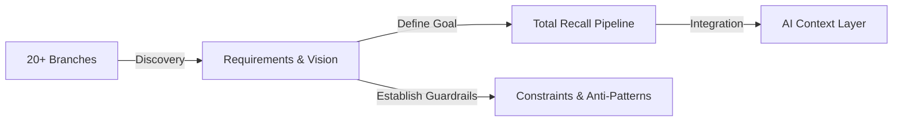

# Screenpipe Recall Pipeline Ideas

This directory contains the core vision and architectural principles for the Screenpipe recall system.

## Primary Documentation
*   **[REQUIREMENTS.md](REQUIREMENTS.md)**: **The High-Priority Vision.** Total digital recall, hierarchical summarization, and FIDO2-encrypted AI context.

## Supporting Reference
*   **[CONSTRAINTS_AND_ANTI_PATTERNS.md](CONSTRAINTS_AND_ANTI_PATTERNS.md)**: Lessons learned from previous failures (e.g., SQLite issues) and architectural boundaries.
*   **[DIRECT_QUOTES_AND_STATEMENTS.md](DIRECT_QUOTES_AND_STATEMENTS.md)**: Source catalog of quotes defining the project vision.
*   **[FOUNDATIONAL_PRINCIPLES_FOUND.md](FOUNDATIONAL_PRINCIPLES_FOUND.md)**: Consolidation of architectural principles.
*   **[ARCHITECTURAL_DOCS_FOUND.md](ARCHITECTURAL_DOCS_FOUND.md)**: Discovery report for historical branch documentation.

### Trajectory Diagram
